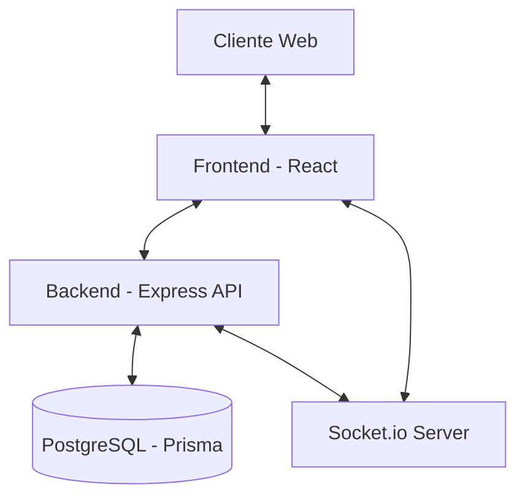
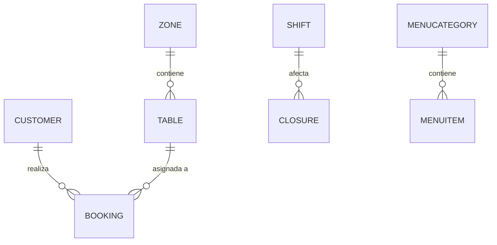

# 🍽️ Restaurant Management System (TFG)

[](LICENSE)
[](https://nodejs.org/)
[](https://reactjs.org/)
[](https://www.prisma.io/)

Una solución integral y moderna para la gestión de reservas, clientes y operaciones de un restaurante. Este proyecto ha sido desarrollado como un **Trabajo de Fin de Grado (TFG)**, enfocándose en la escalabilidad, la experiencia de usuario y la eficiencia operativa.

---

## 📖 Documentación del Proyecto

Este repositorio contiene la documentación completa necesaria para el Trabajo de Fin de Grado. Puedes consultar los detalles en los siguientes enlaces:

- 📜 [**Memoria Técnica Completa (TFG_REPORT.md)**](./docs/TFG_REPORT.md) - *Documento principal con toda la información requerida.*
- ⚙️ [**README del Backend**](./backend/README.md) - *Instalación y detalles técnicos de la API.*
- 🎨 [**README del Frontend**](./frontend/README.md) - *Instalación y detalles técnicos de la interfaz.*
- 🏛️ [Arquitectura del Sistema](./docs/ARCHITECTURE.md)
- 🗄️ [Detalle del Esquema de BD](./docs/DATABASE_SCHEMA.md)

---

## 🎯 Resumen y Propósito
El **Sistema de Gestión de Restaurantes** es una plataforma diseñada para centralizar la operativa de un restaurante. Permite a los clientes realizar reservas online y a los administradores gestionar el local, las mesas, los turnos y la base de datos de clientes de forma eficiente y en tiempo real.

---

## 🛠️ Tecnologías Utilizadas
- **Backend:** Node.js, Express, PostgreSQL, Prisma ORM, Socket.io, JWT.
- **Frontend:** React 19, Vite, TypeScript, i18next, Tailwind CSS / Vanilla CSS.
- **Infraestructura:** Docker, Docker Compose, pgAdmin.

---

## 👥 Roles y Casos de Uso
El sistema está diseñado para tres tipos de usuarios:

1. **Cliente (Público):**
   - Realizar reservas y consultar disponibilidad.
   - Consultar el menú interactivo multilingüe.
2. **Personal (Staff):**
   - Controlar el flujo de comensales en tiempo real.
   - Asignar mesas y gestionar estados de reserva.
   - Consultar perfiles de clientes y alérgenos.
3. **Administrador:**
   - Configurar la estructura del local (Zonas/Mesas).
   - Definir horarios, turnos y cierres.
   - Gestionar el menú y los usuarios del sistema.

### 🔑 Credenciales de Prueba (Demo)
Para evaluar el sistema y acceder al panel de administración (`/admin`), puedes utilizar las siguientes credenciales generadas por defecto:
- **Usuario:** `admin@mesonmarinero.com`
- **Contraseña:** `admin1234`

---

## 🏗️ Arquitectura del Sistema

El proyecto sigue una arquitectura desacoplada de Cliente-Servidor:

- **Backend:** API REST robusta construida con **Node.js** y **Express**, utilizando **Prisma ORM** para la interacción con la base de datos PostgreSQL.
- **Frontend:** Aplicación web reactiva construida con **React 19** y **Vite**, utilizando **TypeScript** para mayor seguridad y mantenibilidad.
- **Comunicación en Tiempo Real:** Implementación de **Socket.io** para actualizaciones instantáneas entre el portal de clientes y el panel de administración.



---

## 🗄️ Modelo de Datos y Tablas

El sistema utiliza un modelo relacional centrado en la eficiencia operativa.

### Diagrama ER (Resumen)


### Tablas Principales
- **Customer:** CRM y fidelización.
- **Booking:** Gestión de reservas y estados.
- **Table / Zone:** Infraestructura física del local.
- **Shift / Closure:** Control de disponibilidad horaria.
- **Staff:** Gestión de accesos.

---

## 📦 Instalación y Configuración

### Requisitos Previos
- Node.js (>= 18.0.0)
- Docker & Docker Compose (Recomendado para la base de datos)
- npm o yarn

### Pasos Generales
1. **Clonar el repositorio:**
   ```bash
    git clone https://github.com/Amolnav/TFG
    cd TFG
   ```

2. **Configurar variables de entorno:**
   Copia los archivos `.env.example` (si existen) o crea archivos `.env` en la raíz, `/backend` y `/frontend`.

3. **Levantar la infraestructura (Base de Datos):**
   ```bash
   docker-compose up -d
   ```

4. **Instalar dependencias y ejecutar:**
   Sigue las instrucciones detalladas en cada subdirectorio:
   - [Documentación del Backend](./backend/README.md)
   - [Documentación del Frontend](./frontend/README.md)

---

## 📁 Estructura del Proyecto

```text
.
├── backend/                # API, Base de Datos y Lógica de Servidor -> [Ver README](./backend/README.md)
├── frontend/               # Interfaz de Usuario y Lógica Cliente -> [Ver README](./frontend/README.md)
├── docs/                   # Documentación detallada del sistema
├── docker-compose.yml      # Configuración de Docker (Desarrollo)
├── docker-compose.prod.yml # Configuración de Docker (Producción)
├── testapi.sh              # Script de prueba para la API
└── LICENSE                 # Licencia del proyecto
```

---

## 🚀 Despliegue (Estado Actual)

> [!IMPORTANT]
> **Despliegue objetivo:** El proyecto está diseñado para desplegarse separando el Frontend y Backend utilizando **Render**.

### Pasos de Despliegue en Render

1. **Base de Datos (Render PostgreSQL):**
   - Crear una nueva base de datos PostgreSQL (`Free`).
   - Copiar la *Internal Database URL*.

2. **Backend (Render Web Service):**
   - Conectar el repositorio y seleccionar la carpeta `backend` como *Root Directory*.
   - **Environment:** `Node`
   - **Build Command:** `npm install && npx prisma generate && npx prisma migrate deploy`
   - **Start Command:** `npm start`
   - **Variables de Entorno necesarias:**
     - `DATABASE_URL`: URL interna de la base de datos.
     - `JWT_SECRET`: Clave secreta para los tokens.
     - `FRONTEND_URL`: URL final del frontend en Render (sin barra final).
     - **Configuración SMTP (Ej. Mailtrap para TFGs):**
       - `SMTP_HOST`: `sandbox.smtp.mailtrap.io`
       - `SMTP_PORT`: `2525` (Render bloquea 465/587 en el tier gratuito)
       - `SMTP_USER` / `SMTP_PASS` / `SMTP_FROM`

3. **Frontend (Render Static Site):**
   - Seleccionar la carpeta `frontend` como *Root Directory*.
   - **Build Command:** `npm install && npm run build`
   - **Publish Directory:** `dist`
   - **Variables de Entorno necesarias:**
     - `VITE_API_URL`: URL del backend terminada en `/api` (ej. `https://mi-backend.onrender.com/api`).
     - `VITE_SOCKET_URL`: URL base del backend (ej. `https://mi-backend.onrender.com`).
   - **⚠️ Redirects/Rewrites (CRÍTICO para React Router):**
     - Crear una regla: `Source: /*` -> `Destination: /index.html` -> `Action: Rewrite`.

4. **Semilla de Datos (Seed):**
   - Para poblar la base de datos inicial, ejecuta `bash seed-prod.sh` dentro de la carpeta `backend` localmente, o configúralo temporalmente en el Build Command de Render.

---

## 📸 Capturas de Pantalla

<table>
  <tr>
    <td><br/><sub>Portal Público - Home</sub></td>
    <td><br/><sub>Panel de Administración</sub></td>
  </tr>
</table>

---

## 📜 Licencia

Este proyecto está bajo la protección de **Todos los derechos reservados**. Consulta el archivo [LICENSE](LICENSE) para más detalles.
